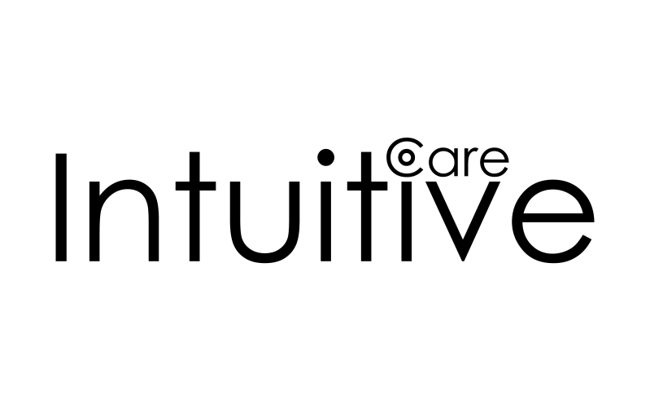

 

<width="10%">

  

  

## 💻 Sobre
Esta etapa do processo seletivo consiste na realização de testes de nivelamento. Estes testes foram desenhados em função de tarefas realizadas no dia a dia da empresa e têm como objetivo avaliar:

·      Conhecimentos básicos de programação

·      Organização do código

## 🛠 Tecnologias
As seguintes ferramentas foram usadas na construção do projeto:
* **[Phyton](https://www.python.org/)**
* **[SSMS](https://docs.microsoft.com/pt-br/sql/ssms/download-sql-server-management-studio-ssms?view=sql-server-ver15)**
* **[Visual Studio Code](https://code.visualstudio.com/?WT.mc_id=javascript-9652-gllemos)**

## 📝 Ass

Feito com ❤️ por Thaís Moreira Teixeira 🖖 [Entre em contato!](https://www.linkedin.com/in/tha-moreira/)
